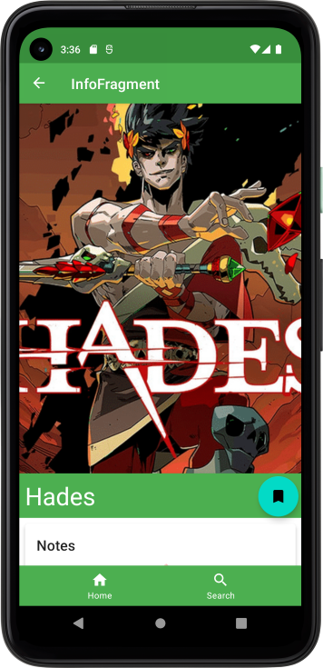

# Too Many Cool Games / TMKG

## Keep track of all the cool games being released!

<br/><br/>



## Summary

**TMKG** helps you keep track of video games and their releases, past present, or future!

Includes features to make recording your notes & personal status quick and easy,
making those day-to-day gaming decisions even easier.

Developed using both official and community-supported libraries, for a cohesive development and user experience. Featuring:
* [Android Jetpack](https://developer.android.com/jetpack) (Room, Navigation, Lifecycle Components) for a solid app architecture
* [Glide](https://github.com/bumptech/glide), for easy image loading and management
* [Material Components for Android](https://material.io/develop/android) for clean UI/UX elements
* [JUnit](https://junit.org/), an industry standard JVM testing framework

A more detailed overview can be found here: [App Overview](/doc/app-overview.md) 

## Build

### Requirements

* Register a [Twitch Account and Application](https://dev.twitch.tv/console/apps/create)
  for [IGDB API](https://api-docs.igdb.com/#account-creation) access.
* Authenticate as a Twitch Developer
  to [generate an access token](https://api-docs.igdb.com/#authentication).
* Add a `dotenv`-style file for IGDB keys and information
    * Path: `<project-root>/app/src/main/assets/env`
    * Required keys:
        * `IGDB_CLIENT_ID`: Your Twitch application's Client ID.
        * `IGDB_ACCESS_TOKEN`: Provided from your OAuth2 authentication response (`access_token`).
        * `IGDB_EXPIRES_SEC`: Provided from your OAuth2 authentication response (`expires_in`).
        * `IGDB_REGENERATED_TIMESTAMP`: Unix epoch (ms) when the token was
          generated ([Epoch Converter](https://www.epochconverter.com/) is a quick and easy way to
          fetch yours)

### Instructions

Build the app:

```shell
./gradlew build
```

Run all tests:

```shell
./gradlew test
```

Run lint checks:

```shell
./gradlew check
```
